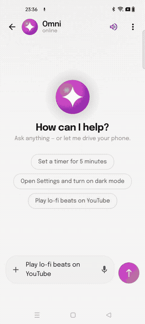

# OmniPro

**An AI assistant that lives on your phone — and can actually use it.**

OmniPro is an Android assistant with three superpowers: it chats (with real cloud
tools like web search and Gmail), it talks (fully on-device speech-to-text and
streaming text-to-speech), and it **drives your phone by itself** — reading the
screen and tapping, typing, and swiping through any app to finish the task you
gave it. Tasks it has done once are learned as routines and replayed near-instantly,
no AI guessing the second time.

## See it work

The agent asked to *"Play lo-fi beats on YouTube"* — it opens YouTube, searches,
and starts playback on its own (this run is a **learned routine replay**, which is
why it moves so fast):

  

▶ [Full-quality video](media/demo_automate_youtube.mp4) · more demos in the
[Releases](https://github.com/codeloki15/ONDROID/releases) assets.

## What it can do

- 🤖 **Automate my phone** — give it a goal ("delete all games from my phone",
  "play Believer on YouTube", "open Settings and turn on dark mode") and it
  perceives the screen via the accessibility API, plans, and acts step by step.
  A floating STOP pill keeps you in control the whole time.
- 🧠 **Learns from experience** — every completed task is recorded as a replayable
  routine (with parameter slots, so *"play X on YouTube"* generalizes). Repeat
  tasks skip the planner entirely and execute deterministically in seconds.
- 💬 **Chat with cloud tools** — web search, Gmail, Slack, Calendar and hundreds of
  apps via [Composio](https://composio.dev), driven by the model through tool
  calling (bring your own keys).
- 🎙 **Voice, fully on-device** — NVIDIA Parakeet speech-to-text (sherpa-onnx) and
  Kokoro streaming text-to-speech: speech starts ~1 s after the reply begins.
  Say **"Hey Omni"** from any screen to invoke it hands-free.
- 🔒 **Your keys, your device** — no backend of ours. The LLM runs via your
  OpenRouter key; voice models run on the phone; automation never leaves the device.

## The three modes

| Home card | What happens |
|---|---|
| **New chat** | Conversational AI + Composio cloud tools |
| **Voice chat** | The same brain, hands-free — live transcription in, spoken replies out |
| **Automate my phone** | The screen-driving agent with routine memory |

## Get started

- **Fastest:** install the prebuilt APK from the
  [latest Release](https://github.com/codeloki15/ONDROID/releases) →
  then follow the 5-minute [first-run configuration](SETUP.md#first-run-configuration).
- **From source:** see [SETUP.md](SETUP.md) — needs Android Studio and **git-lfs**
  (the voice/wake-word models are stored in LFS).

## Tech

Kotlin · Jetpack Compose (Material 3, custom "Porcelain" design system) · Hilt ·
Room · OpenRouter (OpenAI-compatible tool calling) · Composio Tool Router (MCP) ·
sherpa-onnx (Parakeet STT, Kokoro TTS, zipformer wake word, Silero VAD) ·
AccessibilityService + MediaProjection for the screen agent.

---

*OmniPro drives your real apps and accounts. The agent asks before destructive
steps and can always be stopped with the on-screen STOP pill, but supervise it
like you would a very fast intern.*
